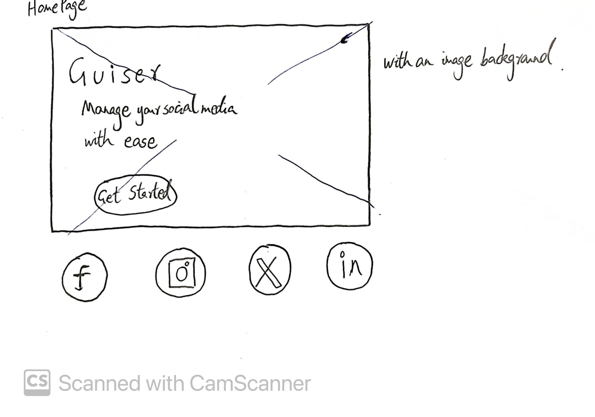
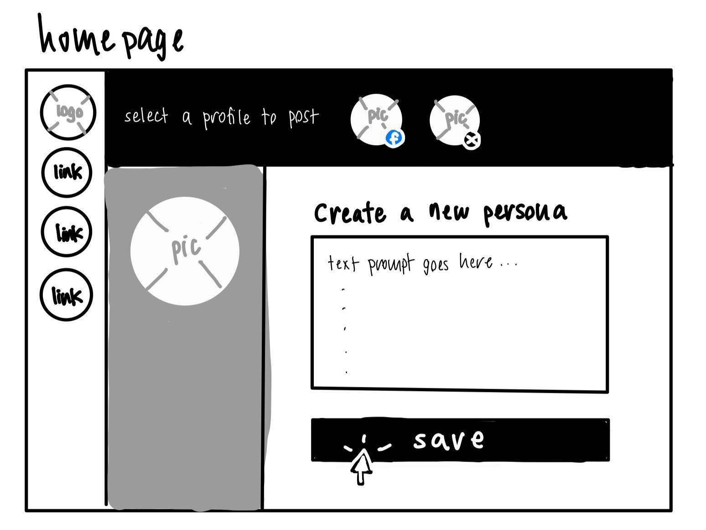

# Group 02 - Guiser

Transform your content game with Guiser (pronounced like 'geyser'): a revolutionary app that lets you design multiple personas for any niche, generate targeted content, and seamlessly post to social media. Perfect for content creators, social media managers, or anyone looking to effortlessly boost their online presence.

https://guiser.onrender.com/

## Project Goals

### Minimal Requirements
- ✅ User Authentication: Implement authentication mechanisms for both Guiser and the social media sites it posts to
- ✅ Persona Development: Implement persona management and the linking of these personas to social media accounts
- ✅ Content Generation: Enable the generation of text content tailored to personas
- ✅ Content Distribution: Automate the posting of generated content to one social media website

### Standard Requirements
- ✅ Extended Content Distribution: Automate the posting of generated content to a second social media website
- ✅ Responsive Web Design: Design the interface to be simple and functional on both desktop and mobile devices
- ✅ Content Storage: Store generated content so that it can be used to generate follow-up content
- ✅ Content Editing: Allow users to modify generated content before it is posted to social media websites
- ✅ Soft Delete: Implement soft delete on all MongoDB collections in our DB

### Stretch Requirements
- ✅ Extended Content Distribution: Automate the posting of generated content to a third social media website
- Extended Content Generation and Distribution: Enable the generation of image content tailored to personas and posting on an appropriate site
- Photo capability: Enable users to attach photos to text content for publishing
- Content Scheduling: Develop a basic scheduling system where users can set dates and times for posts to be automatically published on connected platforms
- Advanced Analytics: Use machine learning to predict the best times for posting and the potential engagement level of different content types

## Technology Utilization

### Unit 1: HTML, CSS, and JavaScript
In Unit 1, we learned the basics of HTML, CSS, and JavaScript, which provide the foundation for our web application. HTML is essential for
displaying the content we want to display to our users. CSS on the other hand styles this content the way we want it to appear to users, ensuring content is visually appealing and user-friendly. The fundamental knowledge of JavaScript from this unit helped us bring our website to life and make it dynamic. Our understanding of JS also provided a solid foundation for more advanced topics.

### Unit 2: React & Redux
Unit 2 introduced us to React and Redux, which we utilized extensively for our front-end development. React allowed us to create dynamic and responsive user interfaces with significantly less time and effort than using just vanilla HTML/CSS/JS. Redux helped manage the application state efficiently while leveraging React's virtual DOM. The integration of 'createSlice' from Redux Toolkit enabled us to delegate enforcing the immutability of Redux actions and state updates to Redux itself, making it easier to provide a smooth user experience.

### Unit 3: NodeJS & Express
In Unit 3, we learned about backend development using Node.js and Express, which we implemented to set up our server and handle API requests. Express facilitated the creation of routers and controllers for user authentication, content management, and social media interactions. Compared to other backend frameworks like Django or Ruby on Rails, Express and Node provided a lightweight and flexible solution that perfectly complemented our JavaScript-based front end.

### Unit4: MongoDB
Unit 4 covered MongoDB, a NoSQL database, which we used to store and manage our application's data. We designed collection schemas for users, personas, content, social media tokens, and social media websites, enabling us to organize and retrieve data efficiently. Compared to SQL databases, MongoDB offered a more flexible schema design, which was particularly useful for handling the dynamic data structures in our application.

### Unit 5: Release Engineering
In Unit 5, we focused on release engineering and deploying our application, which we achieved using Render.com and GitHub Actions. This unit taught us the importance of continuous integration and deployment, allowing us to maintain a production-ready application while reducing monotonous manual work and possible errors. The automated deployment process ensured that our latest updates were always live, and the workflow status badge in our README file provided real-time deployment status.

## Above and Beyond Functionality

Our project, Guiser, significantly exceeds course requirements with advanced features resembling those of a small start-up. By integrating generative AI, multiple social media APIs, and responsive design, we provide a seamless and intelligent content creation and distribution platform.

We utilized state-of-the-art generative AI services, such as Google Generative AI and Together AI, to dynamically generate high-quality, persona-specific content based on contextual prompts. This ensures authentic, engaging content that enhances the app’s value and uniqueness.
Additionally, we integrated APIs from Twitter, Threads, and LinkedIn, enabling users to authenticate, obtain auth tokens, and post content directly from Guiser. This multi-platform integration streamlines content distribution, enhancing reach and efficiency. Lastly, we ensured our application is designed responsively.

These advanced features significantly improve Guiser’s capabilities. The generative AI models create highly engaging, contextually relevant content, while the multi-platform integration allows effortless management of online presence. These functionalities showcase our ability to implement cutting-edge technologies and complex systems, reflecting professional-level sophistication and technical prowess.

In conclusion, Guiser not only meets but exceeds course requirements by incorporating advanced AI and API integrations, positioning it as a powerful and innovative tool for social media management.

## Next Steps
To further improve Guiser, we could enable image content generation and distribution, and add photo attachment capabilities as listed in our stretch goals. We could also develop a content scheduling system to allow automatic publishing at optimal times. Additionally, incorporating advanced analytics would help optimize post timing and engagement, making Guiser more powerful and user-friendly for content creators and social media managers.

## List of Contributions (2-3 sentences)
- Shumin Wang:
Throughout the project, I developed a visually appealing and functional landing page, implemented Twitter user authentication, and integrated essential features such as Twitter posting. Additionally, I contributed to the development of the Personas front page and addressed critical challenges, including seamless page connectivity, responsive design, and OAuth integration. These efforts ensured a smooth and user-friendly experience, significantly enhancing the app's functionality, usability, and overall user engagement.

- Brant Shapka:
I implemented significant parts of the frontend (the Generate and Content pages), created and initialized the backend server, created and designed the MongoDB instance, wrote Mongoose models for the db, and wrote a significant chunk of the backend code responsible for CRUD functionality related to these db models/collections. In addition to this, I implemented LinkedIn user authentication/OAuth integration along with LinkedIn posting, thereby adding support for one of the three supported social media platforms. Lastly, I managed the deployment/hosting of the app and spent extra time testing the app.

- Ewan Townshend:
I implemented Google authentication, Threads OAuth integration and Threads posting, and infrastructure for session management, all spanning front and back end. I also pitched and refined the app idea, made various UI and server-side changes, implemented the (current) LLM integration, and set up / linked admin and tester accounts for platform integrations.

- Kiara Melocoton:
I implemented the Persona page with CRUD functionality and redux store. I designed and developed a major user interface overhaul for the entire application by creating themes in Material UI to convert our separate div/css based pages into a streamlined component based structure to have consistent design for every page. I added many tweaks to help user experience such as: converting the datetime object into a readable format, creating verification for expired tokens, adding tooltips to display full text properly, modifying helper text and buttons to have clear readability using icons, sizing and colors.

# Demo accounts

| Username                     | Email                     | Password       | Type       |
|------------------------------|---------------------------|----------------|------------|
| guiser.user.az@gmail.com     | guiser.user.az@gmail.com  | projectadmin   | Google     |
| guiser.user.az@gmail.com     | guiser.user.az@gmail.com  | projectadmin   | Threads    |
| guiserteam@gmail.com         | guiserteam@gmail.com      | projectadmin   | LinkedIn   |
| bella_guiser                 | guiserteam@outlook.com    | projectadmin   | Twitter    |

This is the end of the Final Project Report.

---

## How To Run Frontend
1. `cd` to a frontend location
2. `npm install` using node version 20
3. `npm run dev` to run on localhost

## How To Run Backend
1. `cd` to a backend location
2. `npm install` using node version 20
3. `npm run build` to compile Typescript
4. `npm run start` to start the server

## Prototype Sketches

### Landing Page

### Login Page

### Persona Management Page

